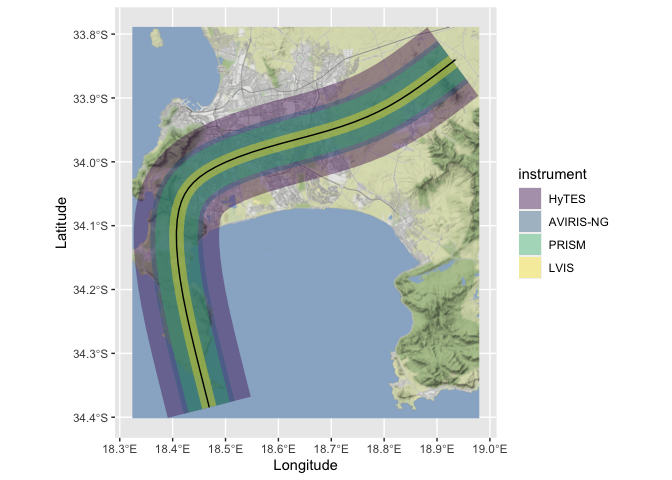

BioSCape Flight Geometry Calculation
================

``` r
library(sf)
library(units)
library(tidyverse)
library(cowplot)
library(gridExtra)
library(ggforce)
library(ggmap)
library(data.table)
library(piggyback)
library(geosphere)
source("R/make_flight_line.R")
```

## Define working projection

``` r
wproj="+proj=utm +zone=34 +south +ellps=WGS84 +datum=WGS84 +units=m +no_defs" # working projection 
```

# Aircraft Details

``` r
g3_altitude=set_units(c(28000,41000,45000),feet)
g5_altitude=set_units(c(28000,41000,51000),feet)
h_feet=g3_altitude

h=set_units(h_feet, km)  #altitude in km
```

# Instrument Details

## AVIRIS-NG

Details from <https://avirisng.jpl.nasa.gov/specifications.html>

``` r
AVIRISNG=data.frame(
  instrument="AVIRIS-NG",
  row=1, #just used for plotting
  tfov=set_units(36,degrees),
  ifov=set_units(1,mrad),
  spec_n=480,
  spec_res=set_units(5,nm),
  spec_min=set_units(380,nm),
  spec_max=set_units(2510,nm)
)
```

## HyTES

Details from
<https://directory.eoportal.org/web/eoportal/airborne-sensors/hytes>

``` r
HyTES=data.frame(
  instrument="HyTES", 
  row=2, #just used for plotting
  tfov=set_units(50,degrees),
  ifov=set_units(1.44,mrad),
  spec_n=256,
  spec_res=set_units(17.6,nm),
  spec_min=set_units(set_units(7.5,um),nm),
  spec_max=set_units(set_units(12,um),nm)
)
```

## PRISM

Details from <https://prism.jpl.nasa.gov/spectrometer_char.html>

``` r
PRISM=data.frame(
  instrument="PRISM",
  row=3, #just used for plotting
  tfov=set_units(30.7,degrees),
  ifov=set_units(0.97,mrad),
  spec_n=608,
  spec_res=set_units(2.83,nm),
  spec_min=set_units(349.9,nm),
  spec_max=set_units(1053.5,nm)
)
```

## LVIS

``` r
LVIS=data.frame(
  instrument="LVIS",
  row=4, #just used for plotting
  tfov=set_units(200,mrad) %>% set_units(degrees), #https://lvis.gsfc.nasa.gov/Data/Maps/ABoVE2019Map.html
  ifov=set_units(0.75,mrad),
  spec_n=1,
  spec_res=set_units(1,nm),
  spec_min=set_units(1064,nm),
  spec_max=set_units(1064,nm)
)
```

## Instrument Summary

``` r
sensors=bind_rows(AVIRISNG,HyTES,PRISM,LVIS) %>% 
  mutate(
    swath_width_low=tan(tfov)*min(h),  #swath width low altitude
    swath_width_mid=tan(tfov)*median(h),  #swath width low altitude
    swath_width_high=tan(tfov)*max(h),  #swath width high altitude
    spatial_resolution_low=tan(set_units(ifov,radians))*min(h) %>% set_units(m),  # spatial resolution in m
    spatial_resolution_mid=tan(set_units(ifov,radians))*median(h) %>% set_units(m),  # spatial resolution in m
    spatial_resolution_high=tan(set_units(ifov,radians))*max(h) %>% set_units(m)) %>%   # spatial resolution in m
  mutate(
    swath_width_km=paste0("[",round(swath_width_low,2),",",
                          round(swath_width_high,2),"]"),
    spatial_resolution_m=paste0("[",round(spatial_resolution_low,2),",",
                                round(spatial_resolution_high),"]"))

sensors %>% 
  select(instrument,
         spectral_bands=spec_n,spectral_resolution=spec_res,
         swath_width_km,spatial_resolution_m) %>% 
DT::datatable()
```

<!-- -->

# Typical flights

G3 <https://jsc-aircraft-ops.jsc.nasa.gov/gulfstream-giii.html> 6 hours
/ 2,600 nautical miles = 4815.2 km

``` r
d=4815*(5/6) # 6 hour flight coverage in km (minus one hour for takeoff/landing)
set_units(d,"km")
```

    ## 4012.5 [km]

# Example Path

``` r
path=st_linestring(x=as.matrix(rbind(
  c(18.47881,-34.37332),
  c(18.41166,-33.91458))),dim="XY") %>% 
  st_sfc() %>% st_sf(path=1,geom=.,crs=4326)
```

## Calculate instrument polygons

``` r
flights <- sensors %>% 
  rowwise() %>% 
  mutate(geometry=make_flight_line(path=path,
                                   swath_width = swath_width_mid)) %>% 
  st_as_sf() %>%
  mutate(instrument=factor(instrument,ordered=T,levels = c("HyTES","AVIRIS-NG","PRISM","LVIS")))


bbox=flights %>% #st_transform(flights,4326) %>% 
  st_buffer(dist = 0.2) %>% 
  st_bbox();names(bbox)=c("left","bottom","right","top")

hdf <- get_map(location=bbox,
              maptype="toner", zoom=12,
              source="stamen")
#hdf <- get_map(location=bbox,  #different background
#               maptype="satellite", zoom=12)
```

## Visualize flight path

``` r
ggmap(hdf, extent = "normal")+
  geom_sf(data=st_transform(flights,4326),mapping=aes(fill=instrument),
          alpha=.4,color=NA,inherit.aes = F)+
  ylab("Latitude")+
  xlab("Longitude")
```

    ## Coordinate system already present. Adding new coordinate system, which will replace the existing one.

<!-- -->

# Write KML for Google Earth Visualization

``` r
flights %>% 
  st_segmentize(50) %>% 
#  mutate(OGR_STYLE = "BRUSH(fc:#0000FF80); PEN(c:#FF0000,w:1px)") %>%  #fiddle with kml aesthetics
  st_write("data/transect.kml",append=F,altitudeMode="clampToGround")
```

    ## Writing layer `transect' to data source `data/transect.kml' using driver `KML'
    ## Writing 4 features with 16 fields and geometry type Polygon.

``` r
if(F){  # if desired, push file to github release
  tag="v0.0.1"
  repo="BioSCape-io/BioSCape_flights"
  pb_new_release(repo, tag)
  pb_upload("data/transect.kml", 
          repo = repo, 
          tag = tag)
}
```
